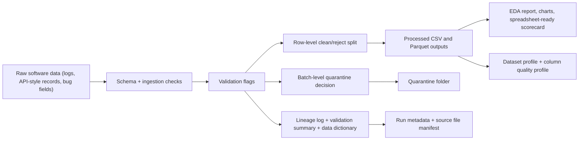
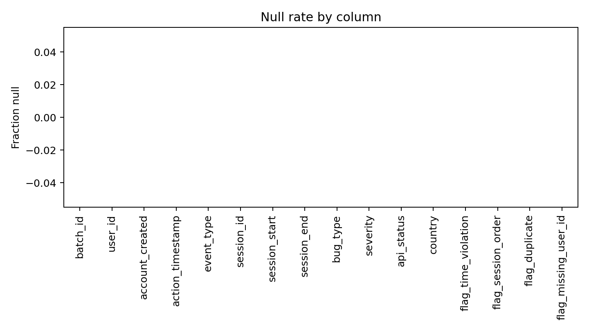
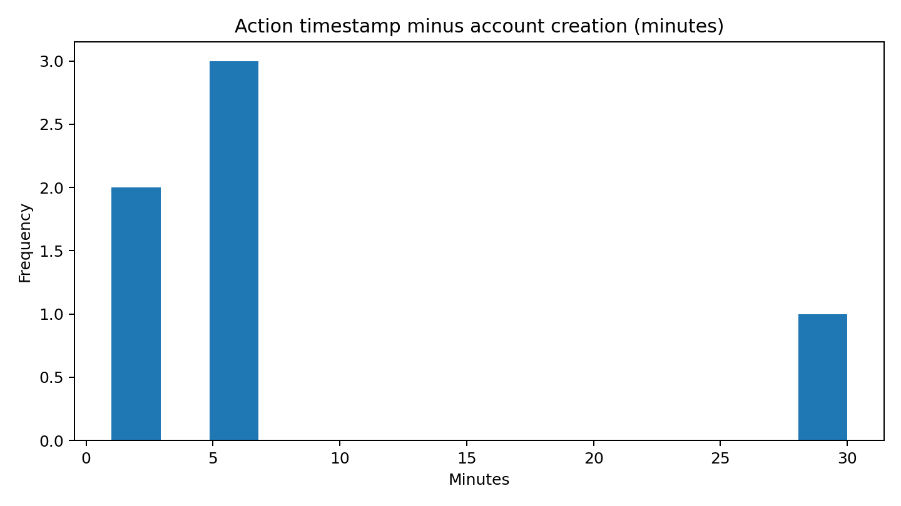

# Data Wrangling & QA Pipeline

A portfolio project tailored for an **Associate Data Scientist (Data Wrangling & QA Engineering)** application.

This repository is built around the exact kind of work described in the role: turning raw software logs, API records, and bug-report style data into clean, structured, analysis-ready outputs with explicit QA logic, metadata, lightweight EDA, reviewer-friendly documentation, and reproducible provenance artifacts.

## Why This Matches The Role
- **Data wrangling:** raw multi-batch software data is transformed into structured CSV and Parquet outputs.
- **The janitor and the architect:** the pipeline flags missing values, removes duplicates, rejects impossible timestamps, and quarantines invalid batches.
- **EDA before deep analysis:** it generates summary statistics, variances, charts, and a markdown report before any downstream modeling.
- **Metadata management:** lineage logs, validation summaries, a data dictionary, run metadata, and source-file fingerprints explain where data came from and why rows or batches were changed.
- **QA intuition:** the project is shaped around software-data edge cases such as timestamp leakage, duplicate events, and session-order violations.
- **Communication:** outputs are split into technical artifacts and spreadsheet-friendly reviewer files that are easy to inspect in Excel or Google Sheets.
- **Research-grade rigor:** the pipeline now adds robust outlier diagnostics, entropy-based categorical profiling, and machine-readable dataset profiling.

## What This Portfolio Demonstrates
- ingestion and schema enforcement for messy raw event-log batches
- row-level validation for duplicates, missing IDs, and temporal anomalies
- batch-level rejection policy when critical quality thresholds are exceeded
- clean versus rejected dataset separation for downstream consumers
- lineage tracking that supports auditability and handoff to analytics or AI teams
- initial analysis with charts plus mean and variance checks
- reproducible provenance via schema versioning, policy metadata, and file hashing
- richer diagnostics through entropy, IQR, MAD, and modified z-score outlier detection

## Portfolio Snapshot

| Metric | Value |
| --- | --- |
| Raw batches | 2 |
| Total input rows | 13 |
| Accepted batches | 1 |
| Rejected batches | 1 |
| Accepted rows | 6 |
| Rejected rows | 7 |

## Pipeline Flow



## Key Quality Rules
- reject duplicate events based on user, timestamp, event type, and session
- reject records with missing `user_id`
- reject records where `action_timestamp < account_created`
- reject records where `session_end < session_start`
- reject an entire batch when timestamp leakage exceeds 10 percent

## Tech Stack
- Python
- Pandas
- NumPy
- DuckDB / SQL
- PyArrow / Parquet
- Matplotlib
- Pytest

## Repository Tour
- `src/`: ingestion, validation, cleaning, lineage, and EDA logic
- `sql/`: SQL-based null, surface, and temporal checks
- `data/raw/`: sample messy software-data batches
- `data/processed/`: clean and rejected outputs in CSV, plus local Parquet exports
- `data/quarantine/`: fully rejected batches
- `data/lineage/`: batch lineage log, validation summary, data dictionary, and run metadata
- `reports/`: markdown report, reviewer scorecard, generated figures, and profiling artifacts
- `examples/`: runnable pipeline entrypoint and expected-output notes
- `tests/`: unit tests covering ingest, validation, cleaning, and lineage behavior

## Quick Start

```bash
pip install -r requirements.txt
python examples/run_pipeline.py
python -m pytest -q
```

## Generated Outputs
- `data/processed/clean_logs.csv`
- `data/processed/rejected_rows.csv`
- `data/processed/*.parquet` when run locally
- `data/lineage/batch_lineage.json`
- `data/lineage/data_dictionary.csv`
- `data/lineage/validation_summary.csv`
- `data/lineage/run_metadata.json`
- `reports/batch_quality_scorecard.csv`
- `reports/column_quality_profile.csv`
- `reports/dataset_profile.json`
- `reports/summary_report.md`
- `reports/figures/*.png`

## What A Hiring Reviewer Should Notice
- This repo is structured like a compact ETL and QA pipeline, not just an exploratory notebook.
- The project explicitly bridges raw software data and downstream analytics-ready datasets.
- Validation logic is visible, testable, and easy to explain to technical and non-technical stakeholders.
- The scorecard and CSV outputs are ready to open in Excel or Google Sheets for wider team review.
- The project shows comfort with software lifecycle-style thinking, where data issues are treated like defects that need triage, explanation, and documentation.
- The profiling layer shows stronger statistical discipline than a basic cleaning script, including entropy and robust outlier methods.

## Sample Report Artifacts





## Application Support
- See [PROJECT_OVERVIEW.md](PROJECT_OVERVIEW.md) for the technical framing.
- See [APPLICATION_SUMMARY.md](APPLICATION_SUMMARY.md) for a concise, role-tailored summary of the experience this project demonstrates.
- See [reports/summary_report.md](reports/summary_report.md), [reports/batch_quality_scorecard.csv](reports/batch_quality_scorecard.csv), and [reports/dataset_profile.json](reports/dataset_profile.json) for the latest generated evidence artifacts.

## Fast Review Path
1. Read [APPLICATION_SUMMARY.md](APPLICATION_SUMMARY.md).
2. Open [reports/summary_report.md](reports/summary_report.md).
3. Inspect [data/lineage/batch_lineage.json](data/lineage/batch_lineage.json) and [data/lineage/run_metadata.json](data/lineage/run_metadata.json).
4. Review [reports/dataset_profile.json](reports/dataset_profile.json) for the advanced profiling layer.
5. Review [examples/run_pipeline.py](examples/run_pipeline.py).
6. Run `python examples/run_pipeline.py` and `python -m pytest -q`.
