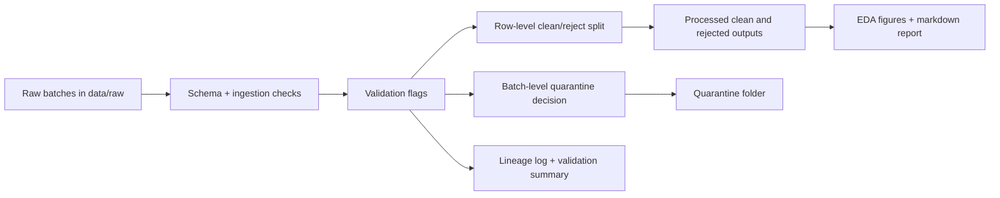

# Data Wrangling & QA Pipeline

A showcase portfolio project for data quality, analytics engineering, and data wrangling roles.

This repository demonstrates how to take messy operational event logs, validate them with explicit QA rules, separate clean and rejected records, quarantine bad batches, preserve lineage, and generate lightweight exploratory reporting for downstream analytics or AI teams.

## Why This Is Portfolio-Worthy
- It shows applied data cleaning, not just notebook exploration.
- It treats data quality as an engineering workflow with repeatable rules.
- It includes both Python and SQL checks, plus tests and reproducible outputs.
- It makes auditability visible through lineage logs, validation summaries, and quarantine decisions.

## What This Project Demonstrates
- ingestion and schema enforcement for raw multi-batch CSV inputs
- row-level validation for duplicates, missing IDs, and temporal leakage
- batch-level rejection when critical violation thresholds are exceeded
- clean versus rejected dataset separation for downstream consumers
- lineage documentation and reviewer-friendly reporting
- lightweight EDA artifacts that help explain data quality issues quickly

## Portfolio Snapshot

| Metric | Value |
| --- | --- |
| Raw batches | 2 |
| Total input rows | 13 |
| Accepted batches | 1 |
| Rejected batches | 1 |
| Accepted rows | 6 |
| Rejected rows | 7 |

## Pipeline Flow



## Key Quality Rules
- Reject duplicate events based on user, timestamp, event type, and session.
- Reject records with missing `user_id`.
- Reject records where `action_timestamp < account_created`.
- Reject records where `session_end < session_start`.
- Reject an entire batch when timestamp leakage exceeds 10 percent.

## Tech Stack
- Python
- Pandas
- NumPy
- DuckDB / SQL
- PyArrow / Parquet
- Matplotlib
- Pytest

## Repository Tour
- `src/`: ingestion, validation, cleaning, lineage, and EDA logic
- `sql/`: SQL-based null, surface, and temporal checks
- `data/raw/`: sample messy event-log batches
- `data/processed/`: browser-friendly CSV snapshots plus locally generated Parquet outputs
- `data/quarantine/`: fully rejected batches
- `data/lineage/`: data dictionary, validation summary, and batch lineage log
- `reports/`: markdown report and generated charts
- `examples/`: runnable example entrypoint and expected output notes
- `tests/`: unit tests covering ingest, validation, cleaning, and lineage behavior

## Quick Start

```bash
pip install -r requirements.txt
python examples/run_pipeline.py
python -m pytest -q
```

## Generated Outputs
- `data/processed/clean_logs.csv`
- `data/processed/rejected_rows.csv`
- `data/processed/*.parquet` when run locally
- `data/lineage/batch_lineage.json`
- `data/lineage/data_dictionary.csv`
- `data/lineage/validation_summary.csv`
- `reports/summary_report.md`
- `reports/figures/*.png`

## What A Reviewer Should Notice
- The project is structured like a small production-quality pipeline rather than a single notebook.
- Validation is explicit, testable, and visible in both code and outputs.
- The repository balances technical rigor with communication artifacts a stakeholder can actually review.
- The example data includes both row-level issues and a fully quarantined batch to show decision logic.

## Sample Report Artifacts


## Fast Review Path
1. Read [PROJECT_OVERVIEW.md](PROJECT_OVERVIEW.md) for the technical framing.
2. Open [reports/summary_report.md](reports/summary_report.md) for the latest generated run summary.
3. Inspect [data/lineage/batch_lineage.json](data/lineage/batch_lineage.json) for batch-level decisions.
4. Run `python examples/run_pipeline.py` to regenerate outputs from scratch.
5. Run `python -m pytest -q` to verify the core logic.
